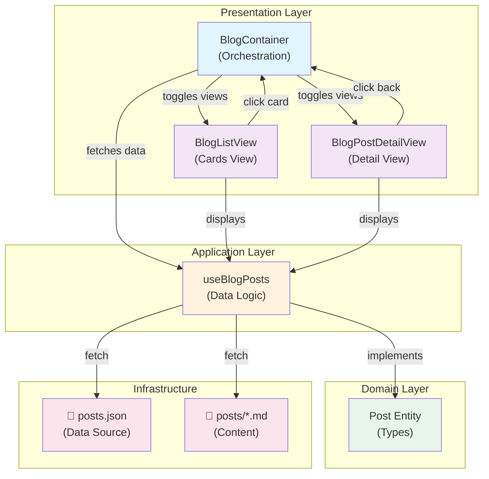

# Diagrama da Arquitetura do Blog



## Fluxo de Dados

```
User opens Blog
    ↓
BlogContainer mounts
    ↓
useBlogPosts fetches /posts.json
    ↓
Posts sorted by date (descending)
    ↓
BlogListView renders cards
    ↓
User clicks "Ler Artigo"
    ↓
selectPost(postId) called
    ↓
useBlogPosts fetches /posts/{id}.md
    ↓
BlogPostDetailView renders markdown
    ↓
User clicks "Voltar"
    ↓
BlogListView renders again
```

## Responsabilidades por Camada

### 🎨 Presentation Layer
- **BlogContainer** - Controla navegação entre views
- **BlogListView** - Exibe lista de posts em cards
- **BlogPostDetailView** - Exibe artigo completo

### 📦 Application Layer  
- **useBlogPosts** - Fetch e gestão de dados
  - Busca posts.json
  - Busca arquivos markdown
  - Ordena por data
  - Trata erros

### 📚 Domain Layer
- **Post** - Define estrutura de dados
  - TypeScript interfaces
  - Validações de tipo

### 🗄️ Infrastructure  
- **posts.json** - Banco de dados local
- **posts/*.md** - Conteúdo dos artigos
