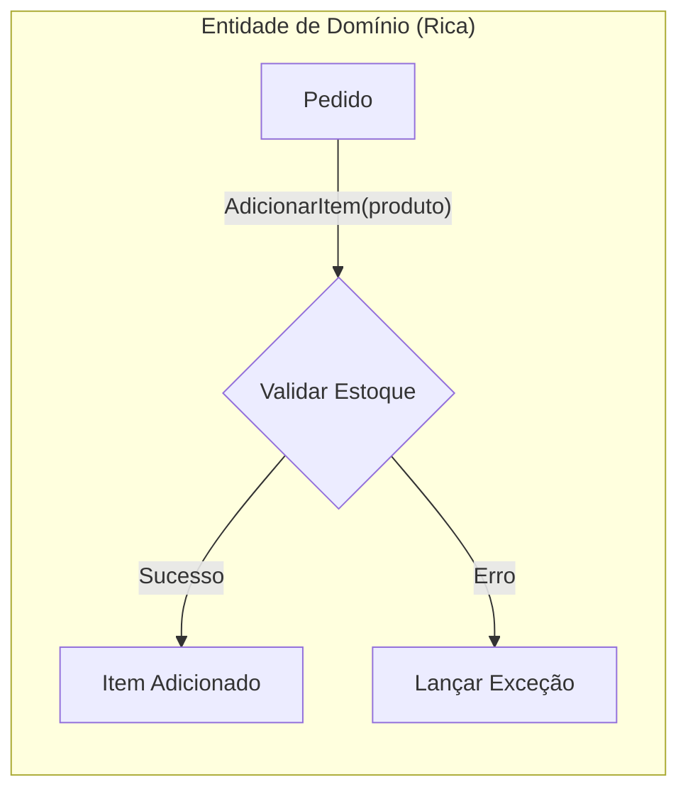
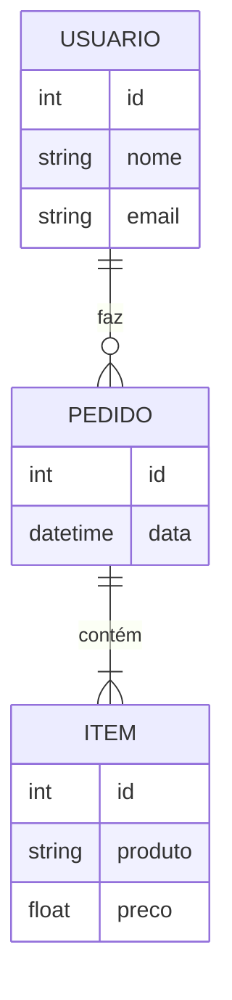
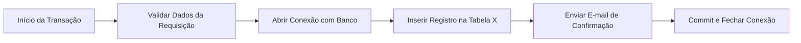
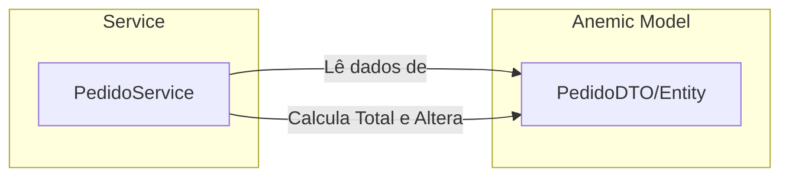
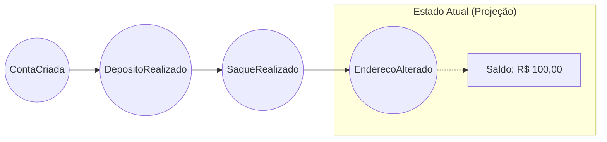
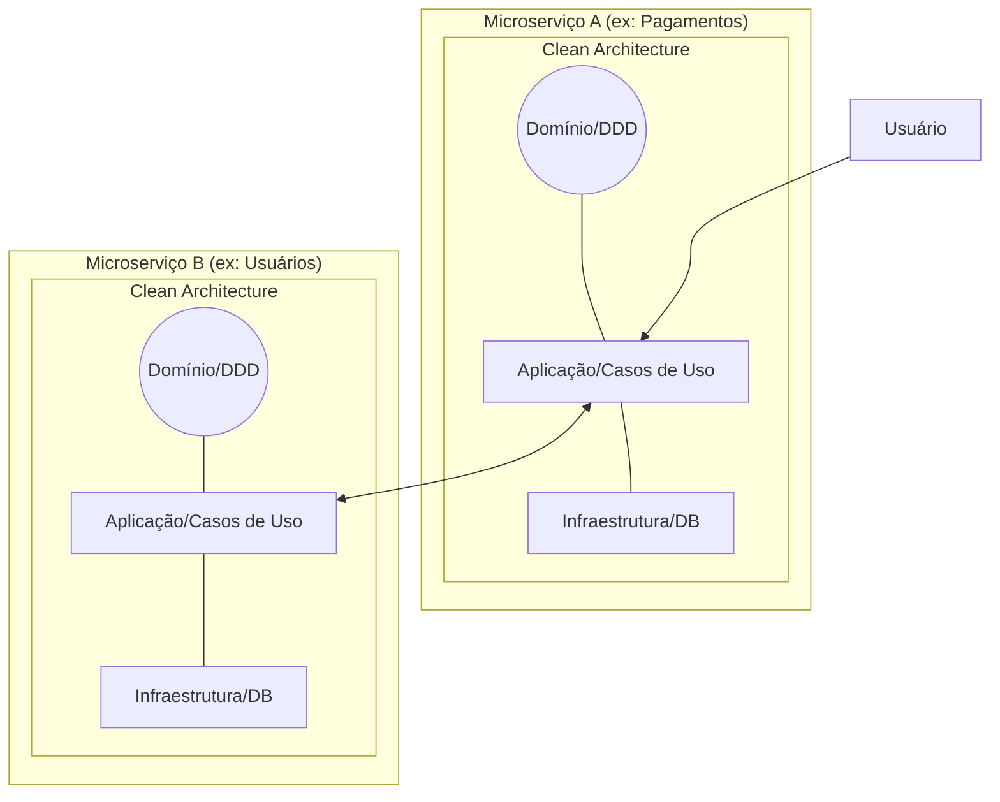
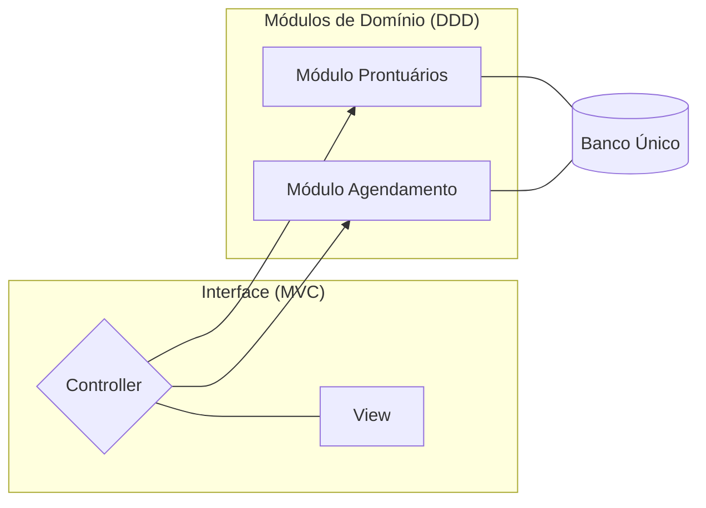
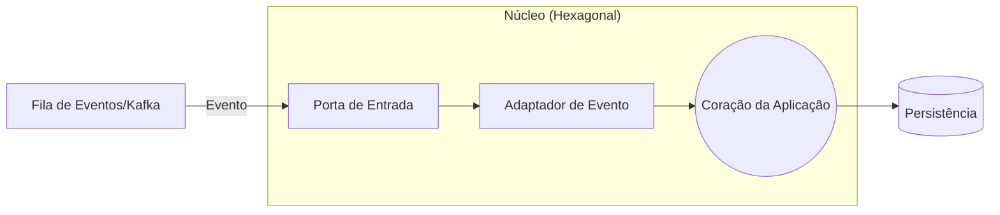
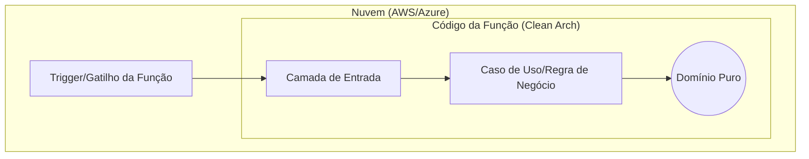

#
Enquanto a **Arquitetura** define as fronteiras (as paredes da casa), a **Metodologia de Design** define como os moradores (as regras de negócio) se comportam e se comunicam.
As combinações entre arquiteturas e metodologias de design permitem que você escolha a melhor ferramenta para cada nível do seu projeto, desde a organização das pastas até a forma como os serviços se comunicam.
A grande sacada da engenharia de software moderna é que essas arquiteturas não são excludentes. Na verdade, elas funcionam como "peças de Lego" que se encaixam em diferentes níveis: Macro (o sistema inteiro) e Micro (dentro de cada serviço).


## Arquiteturas mais relevantes

### MVC
É a base de muitos frameworks modernos como ASP.NET Core MVC e Spring Boot.
* Foco Principal: Separação de Preocupações (Interface vs. Dados).
* O Problema que resolve: Evita que o código de interface (HTML/CSS) fique misturado com a lógica de acesso ao banco de dados.
* Uso ideal: Aplicações web tradicionais e CRUDs, onde a facilidade de desenvolvimento e o suporte do framework são prioridades.

 ```mermaid
sequenceDiagram

Usuario->>View: Preenche nome, email e senha
View->>Controller: POST /cadastro (dados)
Controller->>Model: cadastrarUsuario(nome, email, senha)
Model-->>Controller: cadastrado | erro
Controller-->>View: sucesso | erro
View-->>Usuario: Exibe tela inicial | mensagem de falha

 ```
 
### Clean Architecture
Popularizada por Robert C. Martin (Uncle Bob), o objetivo aqui é a independência total. O núcleo da aplicação (regras de negócio) não deve saber se os dados vêm de um banco SQL, de uma API externa ou se a interface é Web ou Mobile.
* Foco Principal: Independência Tecnológica e Testabilidade.
* O Problema que resolve: O "acoplamento" com frameworks ou bancos de dados. Se o SQL Server sair de linha e você precisar usar MongoDB, o seu "Core" (regras de negócio) permanece intacto.
* Uso ideal: Sistemas complexos que precisam durar muitos anos e onde as regras de negócio são o ativo mais valioso da empresa.
 ```mermaid
sequenceDiagram

Usuario->>View: Preenche nome, email e senha
View->>Controller: POST /cadastro (dados)
Controller->>UseCase: cadastrarUsuario(nome, email, senha)
UseCase->>Repository: salvarUsuario(dados)
Repository-->>UseCase: cadastrado | erro
UseCase-->>Controller: sucesso | erro
Controller-->>View: sucesso | erro
View-->>Usuario: Exibe tela inicial | mensagem de falha

 ```
### Hexagonal Architecture
Muito similar à Clean Architecture. Ela visualiza a aplicação como um núcleo cercado por "portas" (interfaces) onde você conecta "adaptadores" (implementações como banco de dados, serviços de e-mail, etc.).
* Foco Principal: Isolamento do Mundo Externo.
* O Problema que resolve: Facilita a entrada e saída de dados por múltiplos meios. Você pode testar sua lógica via Console, via Teste Unitário ou via API Web usando o mesmo "buraco" (porta).
* Uso ideal: Quando o sistema precisa interagir com muitos serviços externos (vários bancos, APIs de terceiros, sistemas de mensageria).
 ```mermaid
sequenceDiagram

Usuario->>Interface: Preenche nome, email e senha
Interface->>Porta de Entrada: POST /cadastro (dados)
Porta de Entrada->>Aplicacao: cadastrarUsuario(nome, email, senha)
Aplicacao->>Adaptador de Saida: salvarUsuario(dados)
Adaptador de Saida-->>Aplicacao: cadastrado | erro
Aplicacao-->>Porta de Entrada: sucesso | erro
Porta de Entrada-->>Interface: sucesso | erro
Interface-->>Usuario: Exibe tela inicial | mensagem de falha

 ```

### Microservices
Em vez de um único projeto gigante (**Monolito**), você divide a aplicação em vários serviços pequenos e independentes que se comunicam via rede (HTTP, gRPC ou filas).
* Foco Principal: Escalabilidade de Times e Autonomia.
* O Problema que resolve: O "Monolito de Barro". Em sistemas gigantes, um erro em uma parte derruba tudo e 50 desenvolvedores mexendo no mesmo código geram conflitos constantes.
* Uso ideal: Grandes empresas (Netflix, Uber) onde diferentes equipes precisam entregar funcionalidades de forma independente e escalar apenas partes específicas (ex: escalar o login sem escalar o carrinho).

 ```mermaid
sequenceDiagram

Usuario->>API Gateway: Preenche nome, email e senha
API Gateway->>Serviço de Cadastro: POST /cadastro (dados)
Serviço de Cadastro->>Serviço de Usuários: cadastrarUsuario(nome, email, senha)
Serviço de Usuários-->>Serviço de Cadastro: cadastrado | erro
Serviço de Cadastro-->>API Gateway: sucesso | erro
API Gateway-->>Usuario: Exibe tela inicial | mensagem de falha

 ```

### Event-Driven Architecture
O fluxo do sistema é determinado por eventos (ex: "PedidoCriado", "PagamentoConfirmado"). Os componentes reagem a esses eventos de forma assíncrona.
* Foco Principal: Assincronismo e Desacoplamento Total.
* O Problema que resolve: A dependência de "respostas imediatas". Em vez de um sistema travar esperando o outro, ele apenas emite um "aviso" (evento) e continua seu trabalho.
* Uso ideal: Sistemas de rastreamento, notificações em tempo real e processamento de grandes volumes de dados que não precisam ser instantâneos.
 ```mermaid
sequenceDiagram

Usuario->>API: Preenche nome, email e senha
API->>Publicador de Eventos: POST /cadastro (dados)
Publicador de Eventos->>Broker: publicar UsuarioCadastrado
Broker->>Consumidor: entregar evento
Consumidor->>Servico de Usuarios: salvarUsuario(dados)
Servico de Usuarios-->>Consumidor: cadastrado | erro
Consumidor-->>API: sucesso | erro
API-->>Usuario: Exibe tela inicial | mensagem de falha

 ```

### Serverless Architecture
Você foca apenas no código da função (ex: AWS Lambda) e o provedor de nuvem gerencia toda a infraestrutura e escalabilidade automaticamente.
* Foco Principal: Eficiência de Custos e Zero Gerenciamento de Infra.
* O Problema que resolve: O desperdício de pagar por um servidor ligado 24h quando você só precisa processar algo de vez em quando.
* Uso ideal: Tarefas esporádicas, como redimensionar uma imagem após o upload, enviar um e-mail de boas-vindas ou APIs com tráfego muito instável.
 ```mermaid
sequenceDiagram

Usuario->>API Gateway: Preenche nome, email e senha
API Gateway->>Function: POST /cadastro (dados)
Function->>Database: salvarUsuario(dados)
Database-->>Function: cadastrado | erro
Function-->>API Gateway: sucesso | erro
API Gateway-->>Usuario: Exibe tela inicial | mensagem de falha

 ```
## Metodologia de design

### DDD
-   **Foco Principal:** **Complexidade do Negócio.** O código deve ser um reflexo fiel da linguagem e dos processos dos especialistas do domínio.
    
-   **Problema que resolve:** A "lacuna de comunicação" entre desenvolvedores e especialistas de negócio e a dificuldade de manter sistemas com regras muito complexas.
    
-   **Uso Ideal:** Sistemas grandes com regras de negócio ricas e complexas, onde o software precisa durar muito tempo e evoluir sem se tornar uma "caixa preta".



### Data-Driven Design (Design Orientado a Dados)
-   **Foco Principal:** **Persistência e Estrutura de Dados.** O desenvolvimento começa pelo desenho do banco de dados (tabelas e relacionamentos).
    
-   **Problema que resolve:** A complexidade de implementar arquiteturas robustas em cenários onde o objetivo é apenas mover dados de um lugar para outro.
    
-   **Uso Ideal:** Aplicações simples, CRUDs (Create, Read, Update, Delete) básicos, ou sistemas onde o desempenho de consultas pesadas ao banco é mais crítico que a lógica de negócio.

### Transaction Script
-   **Foco Principal:** **Fluxo de Procedimentos.** Organiza a lógica de negócio em torno de transações ou procedimentos únicos que executam uma tarefa do início ao fim.
    
-   **Problema que resolve:** A sobrecarga de criar uma estrutura de objetos complexa para tarefas que são simples sequências de passos.
    
-   **Uso Ideal:** Lógicas de negócio muito simples, scripts de automação ou sistemas pequenos onde a orientação a objetos sofisticada traria mais custo do que benefício.

### Anemic Domain Model
-   **Foco Principal:** **Objetos de Dados Puros.** As classes de domínio possuem apenas propriedades (`getters` e `setters`) e nenhuma lógica interna.
    
-   **Problema que resolve:** Facilita o uso de ferramentas de mapeamento objeto-relacional (ORM) e a serialização de dados, embora seja frequentemente considerado um "anti-padrão" no contexto de DDD.
    
-   **Uso Ideal:** Projetos onde a lógica de negócio é externa aos objetos (está em _Services_) ou em sistemas onde a simplicidade extrema dos objetos facilita a integração com frameworks.

### Event Storming / Event Sourcing
-   **Foco Principal:** **Histórico de Mudanças (Eventos).** O estado atual do sistema não é apenas um valor no banco, mas a soma de todos os eventos que aconteceram no passado.
    
-   **Problema que resolve:** A perda de contexto histórico. Em bancos tradicionais, você sabe o saldo atual, mas no Event Sourcing você sabe exatamente _como_ chegou a esse saldo, facilitando auditorias e reversões.
    
-   **Uso Ideal:** Sistemas financeiros, logística, rastreamento de pedidos e cenários onde a auditoria e a análise histórica de eventos são fundamentais.


## Combinações Estratégicas

<a id="ouro"></a>

### O "Padrão de Ouro": Microservices + Clean Architecture + DDD
Esta é a combinação favorita de grandes empresas (como Netflix e Uber).

-   **Como funciona:** O sistema é dividido em **Microservices** (Macro). Dentro de _cada_ microserviço, você utiliza a **Clean Architecture** para organizar as pastas e o **DDD** para modelar as regras de negócio.
    
-   **Vantagem:** Se você precisar trocar o banco de dados de um serviço específico, a Clean Architecture protege o núcleo, enquanto os Microservices garantem que o restante do sistema nem perceba a mudança.

<a id="pragmatico"></a>

### O Pragmático: MVC + Modular Monolith (DDD)
Ideal para projetos que precisam de velocidade, mas não querem virar uma bagunça (como pode ser o caso do seu TCC, o **Connectamente**).

-   **Como funciona:** Você usa o **MVC** para a camada de interface (Web). No entanto, o "Model" não é apenas uma classe simples; ele é um módulo organizado por domínios do **DDD**.
    
-   **Vantagem:** Menos complexidade de rede que os microsserviços, mas com a organização necessária para crescer de forma estruturada.

<a id="reativo"></a>

### O Reativo: Event-Driven + Hexagonal Architecture
Muito comum em sistemas financeiros ou de telemetria.

-   **Como funciona:** O sistema reage a eventos (Mensageria). A **Arquitetura Hexagonal** entra para criar "Adaptadores" de eventos. Um adaptador escuta uma fila (RabbitMQ/Kafka) e injeta o dado no núcleo da aplicação.
    
-   **Vantagem:** Facilita muito os testes. Você pode simular um evento através de um teste unitário sem precisar de um servidor de mensageria real ligado.

<a id="moderno-economico"></a>

### O Moderno Econômico: Serverless + Clean Architecture
-   **Como funciona:** Você escreve funções isoladas (Lambda/Azure Functions). Mesmo sendo uma função pequena, você aplica os princípios da **Clean Architecture** para que a lógica de negócio não fique "presa" ao código específico do provedor de nuvem (AWS/Azure).
    
-   **Vantagem:** Evita o _vendor lock-in_ (ficar preso a um fornecedor). Se quiser mudar de nuvem, sua regra de negócio está isolada em uma camada pura.

